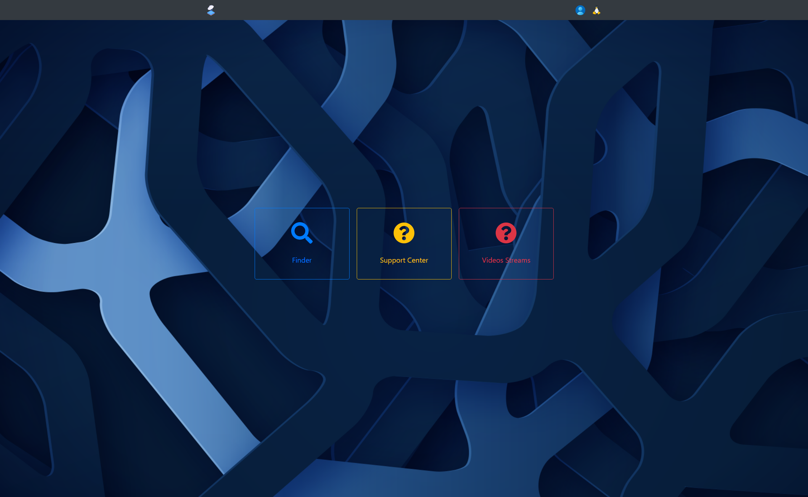

# ocean

_A tool to enhance enterprise productivity_

built with `python`,`django`,`CSS`,`JavaScript`,`HTML`,`Bootstrap4`,`Jquery`,`Sweet Alert`

Ocean is a handful tool for IT Department specifically. For now there are 4 core functionalities.

- **Finder** - This is a search engine for local organization. Where employees can read blogs. These blog content can include any sharing information. The idea behind this is basically to have a how-to articles where employees can read tutorial.
- **Support Center** - This is an open platform where questions can be asked in a form of post and answers can be given as well in the form of comments.
- **Video Stram** - Here we can stream videos uploaded by administrators. Content uploading is limited to administrator because we don't want employees uploading their personal videos on our storage. 
- **OCEAN** - A tool for administrator to manage users, tasks, and inventory

# WHYS
All these core functions are implemented for reasons and they will be outlined below.
- Why Finder - as an IT Lead in my organization, people call asking for support. Most of these supports are not hardware related but procedure related, and also are support requested before. With the help of finder, the employee can be redirected to check from finder first, if there is no article relating to that? A resourceful person will make an article ( how to ) on specific topic and then share the link with the caller.
- Why Support Center - There are moments an employee A is asking for support on a support given to Employee B on same issue. Or maybe aside IT Department, another employee has knowledge on how this issue will be resolved. Support Center is a place where questions can be posted and every authorized user has the chance to answer and these answers will be reviewed by an admin.
- Why Video Stream - There are people who cannot follow instructions from reading rather from watching. With any article shared on finder, there will be a video explaining procedures if the issue has to do with procedure so there can be a watching version as well.
- Why OCEAN - As a platform, there should be ad administrator to moderate content. Since this tool is specifically for IT Department, there should be functions of logging issues, relating them to post in support center, assigning these issues to resourceful person and finally tracking them. There is also an inventory section to manage stock for IT Devices.

#### To A Contributor.
As a contributor, it is important to share your changes so more functions can be merged